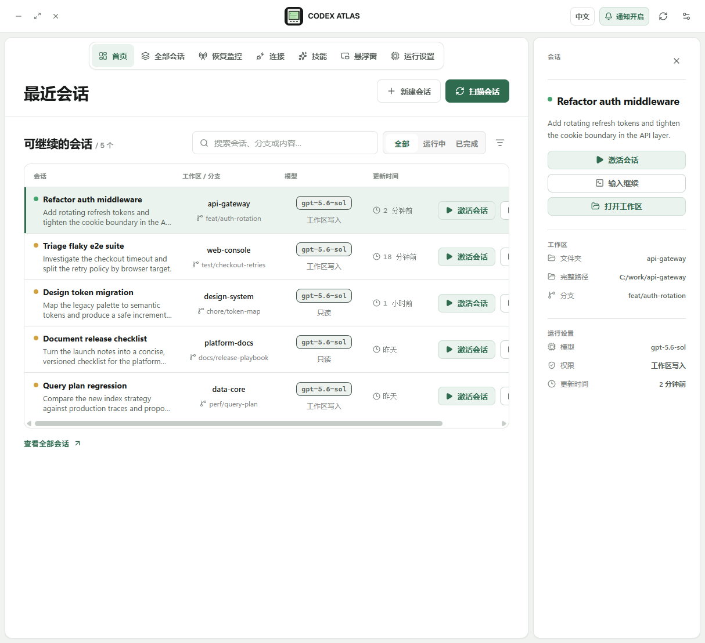
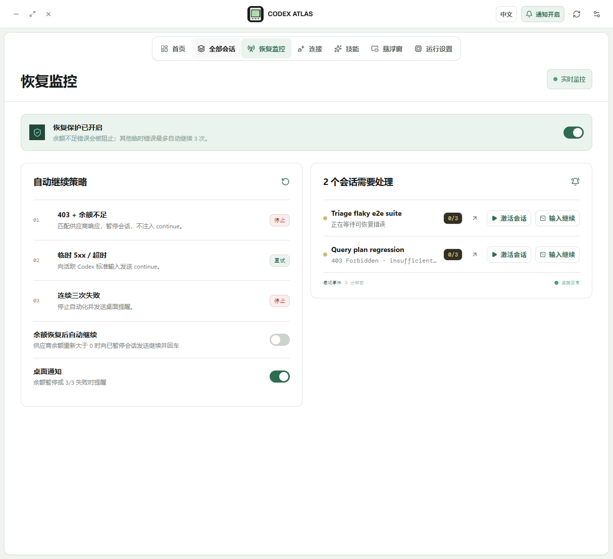
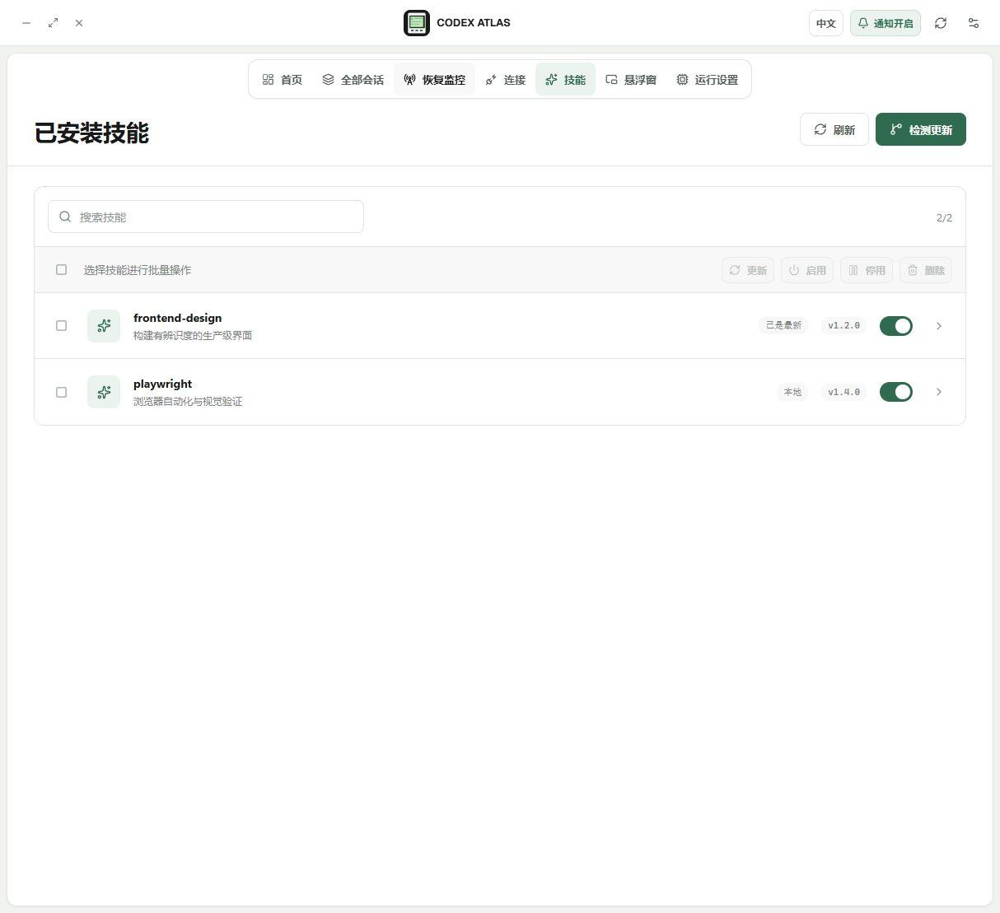
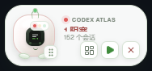

# Codex Atlas

Windows-first Codex session control plane built as a native Tauri desktop app.

## Stack

- React + TypeScript + Vite for the renderer.
- `lucide-react` for a consistent icon system.
- Tauri 2 + Rust for native process discovery, window management, notifications, and local IPC. No localhost listener is required.

## Implemented product surface

- Recent five sessions on the overview, full archive search, status filters, sorting, and session inspector.
- Recovery Monitor with explicit guardrails:
  - `403` + `insufficient balance` / `credit` / `quota` pauses automation and never sends `continue`.
  - Retryable timeout / `5xx` failures can send `continue` up to three attempts.
  - The third consecutive failure stops automation and triggers the notification path.
- CC Switch integration settings for local endpoint, credential-vault API key, provider balance checks, and last-check status.
- Paseo integration settings for executable path, launch, full Codex session import, and recent-session repair.
- Windows notification toggle and an Atlas Mini floating status window with red/yellow/green state lights and quick resume.
- Runtime defaults, Codex versions, installed Skills, and local storage status.
- Cross-platform window controls: minimize the main window and show/hide an always-on-top Atlas Mini window through the Tauri shell.
- Native process-tree discovery for Codex sessions started outside Atlas, including `PowerShell -> node.exe -> codex.exe` chains.
- Runtime state fusion from the Codex process, thread writer lock, rollout events, and optional official Codex hooks.
- Minimal line icon source at `public/codex-atlas-icon.svg` for browser favicon, Windows `.ico`, and macOS `.icns` packaging.

## Real tool contracts verified from public source

CC Switch exposes a Tauri `get_balance(base_url, api_key)` command and session-manager commands such as `list_sessions` and `launch_session_terminal`. Balance is queried per provider credential; the local proxy `/v1/responses` endpoint is not itself a balance endpoint.

Paseo's supported import flow is the daemon-backed command:

```text
paseo import --provider codex <provider-session-id> --cwd <workspace>
```

The Atlas UI uses `paseo_import_agent` and `paseo_import_all_codex_sessions` IPC names so the Tauri shell can call Paseo's daemon/client implementation without coupling the renderer to shell commands.

## Development

```text
npm install
npm run dev
npm run build
```

The browser preview safely falls back to explanatory toasts when the Tauri IPC bridge is unavailable. The desktop shell keeps provider credentials on the native side and maintains a process/session registry for writing `continue` to the correct Codex session.

The renderer uses the same `minimize_window`, `set_floating_window_visible`, and `set_floating_window_size` IPC commands on Windows and macOS. The shell maps them to the native main window and an always-on-top, frameless Atlas Mini window respectively.

The Tauri 2 shell in `src-tauri` reads `$CODEX_HOME/state_5.sqlite` (with a JSONL fallback), launches `codex resume`, keeps a writable stdin handle for guarded `continue` recovery, and exposes Paseo and CC Switch integrations. The standalone Atlas Mini window renders `/?view=floating`.

## Runtime detection

Atlas does not rely on sessions being launched from the app. It scans native process trees, resolves each Codex working directory and command line, and matches it to the session id using resume arguments, active thread writer locks, and rollout metadata. A lightweight runtime scan runs independently from the full searchable session index.

For precise working/waiting/completed transitions, install the status hook from Runtime settings. Atlas uses the existing user-level hook representation: it updates `hooks.json` when that source exists, or appends inline TOML when `config.toml` already contains hooks, so Codex does not receive a second representation from Atlas. It records session lifecycle, prompt, pre/post-tool, permission, Stop, and subagent Stop events; a final assistant message that asks for input remains waiting. Hooks use the canonical `[features].hooks` key and are enabled by default when no feature override exists.

Codex requires review of new non-managed hooks. After first installation, open a new Codex session and use `/hooks` once to review and trust the Atlas hook definition.

The packaged Windows binary can install the hook without opening the UI:

```text
src-tauri\target\release\codex-atlas.exe --install-hook
```

This creates or updates `%USERPROFILE%\.codex\hooks.json`, enables `[features].hooks = true`, and makes a timestamped `.atlas-backup-*` copy before changing an existing configuration.

```text
npm run tauri:dev
npm run tauri:build
```

### Android companion bridge

The desktop app starts an authenticated Atlas Mobile Bridge on port `15730`.
The Runtime page shows the LAN URL and token for the Android companion. The
bridge exposes `GET /v1/status`, `GET /v1/sessions`,
`GET /v1/sessions/{id}/messages`, `POST /v1/sessions`,
`POST /v1/sessions/{id}/message`, `POST /v1/sessions/{id}/activate`,
`POST /v1/sessions/{id}/input`, and `POST /v1/paseo/import-all`. For live
clients, `GET /v1/sync?since=<cursorMs>` returns the current snapshot, session
records, and only rollout messages newer than the supplied cursor. Messages
are read from the same Codex rollout JSONL used by the desktop monitor, so
desktop and Android clients share the same conversation history without
reloading the complete timeline on every poll. Keep the token private and
allow port `15730` through the Windows firewall only on a trusted network.

## 项目与更新

Codex Atlas 的公开项目地址：

<https://github.com/hlok666/codex-atlas>

桌面端在“运行设置”中提供项目主页和最新 Release 入口。Android 伴侣会直接读取 GitHub Releases API，发现新版本后下载 APK，并唤起系统安装页面；没有 APK 资产时会打开对应 Release 页面。发布由 `.github/workflows/release.yml` 在推送 `v*` 标签后自动构建 Windows 安装包和 Android APK。

## 界面截图









## 发布与版本

```text
npm run build
npm run tauri:build
cd android && ./gradlew assembleDebug
git tag v0.1.1
git push origin v0.1.1
```

正式 Android 发布建议配置签名密钥后，将 workflow 中的 `assembleDebug` 换成签名的 `assembleRelease`；当前 workflow 产出的 debug APK 方便预览和测试。
